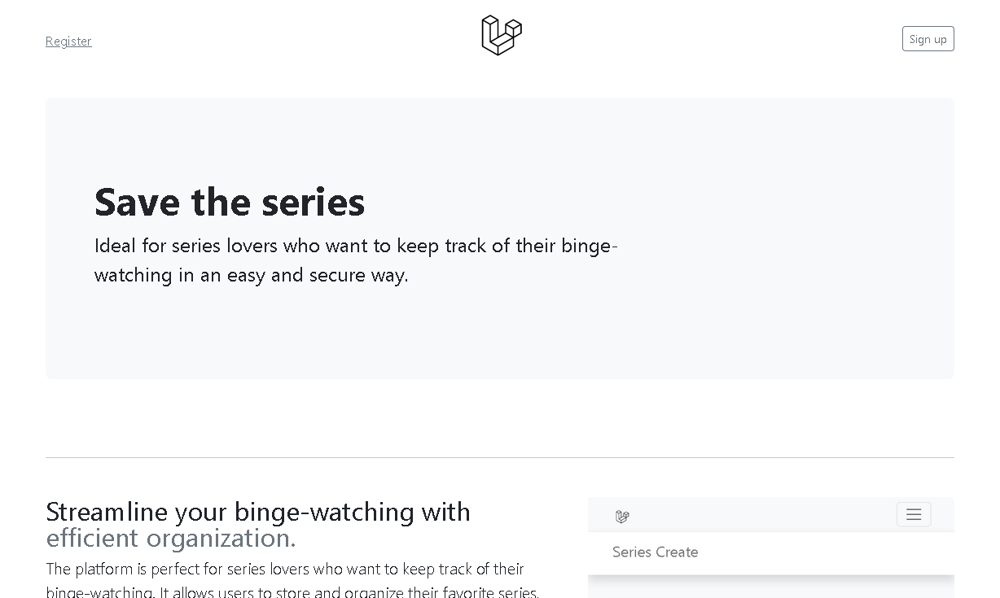

<p align="center">

</p>

[Read this page in English](./README.md)
## Save the series

Sistema de controle de séries escrito em Laravel 9.



## Características

- Adicionar séries com quantidade de temporadas e episódios
- Editar nomes de séries
- Remover séries
- Adicionar temporadas com quantidade de episódios
- Remover última temporada
- Remover último episódio
- Marcar episódios como assistidos

## Instalação

1. Clone este repositório:

```
git clone https://github.com/denisbertaglia/series-control.git
```

2. Instale as dependências php do projeto:

```
composer install
```

3. Crie um arquivo .env e configure as variáveis de ambiente:

```
cp .env.example .env
```

4. Gere a chave de aplicativo:

```
php artisan key:generate
```

5. Configure a conexão como sqlite no arquivo .env.

```
DB_CONNECTION=sqlite
```

6. Execute as migrações para criar tabelas de banco de dados:

```
php artisan migrate
```

7. Instale as dependências js do projeto:

```
npm install

```

8. Gere os ativos para produção

```
npm run build

```

9. Execute os testes:

```
php artisan test
```

10. Inicie o servidor:

```
php artisan serve
```

## Licença

Este projeto está licenciado sob a Licença MIT. Consulte o arquivo [LICENSE](https://opensource.org/licenses/MIT) para obter mais informações.
